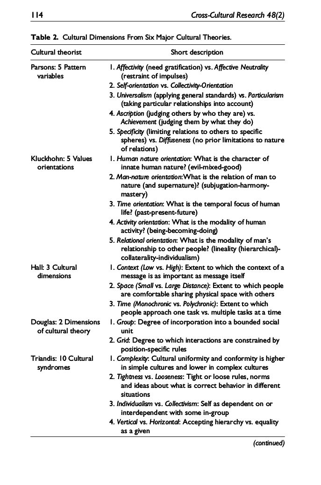
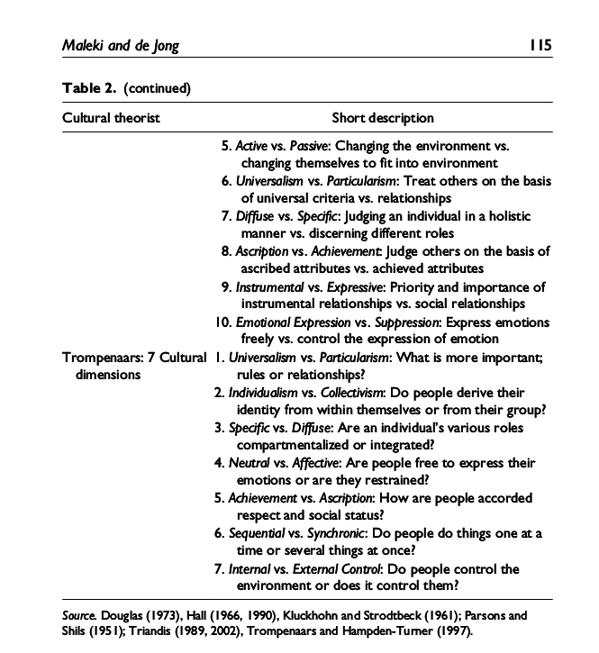
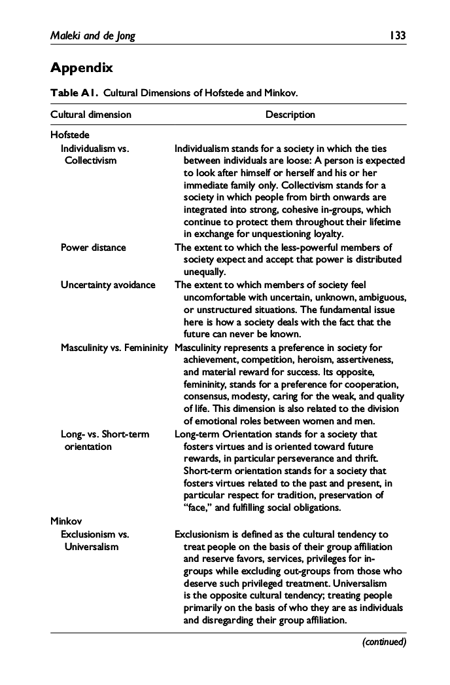
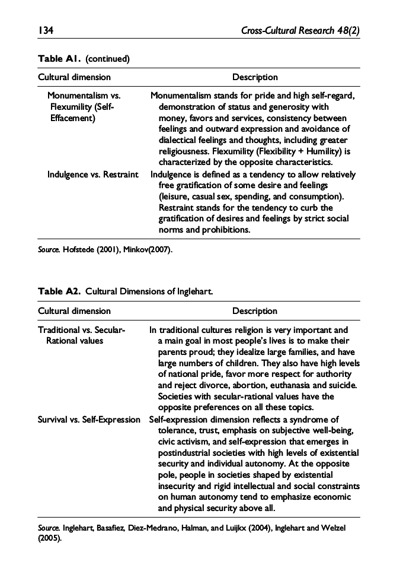
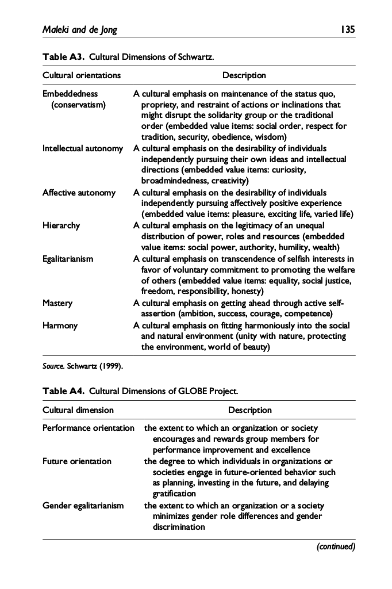
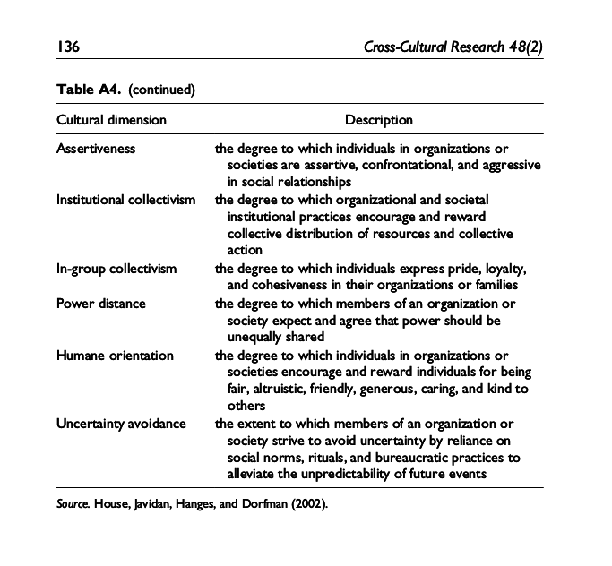
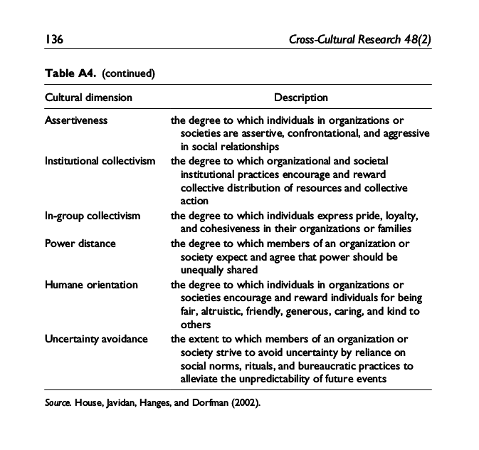

Model Thinking. Scott E. Page.

> Essentially, all models are wrong, but some are useful.
- George E. P. Box

Models aren't necessarily predictive but they can help us understand a system. Just because we can represent a system in its current state (and even past states) does not mean we can necessarily extrapolate our representation further to generate an accurate prediction.

If we want to predict with models, we may have better luck by incorporating multiple models, but there's still no guarantee of anything.

Part of the power of models is their _fertility_; how transferable they are between different domains. They function sort of like metaphors in this sense, where we port a concept from one domain to describe a concept in another.

---

Retrodicting - taking your model and testing it on past data to see if it fits

---

Models help for:

- Real time decision aids - help us figure out when to/when not to intervene
- Comparative statics - what's likely to happen if we make this choice
- Counterfactuals - what would have happened if we hadn't chosen that policy
- Identify and Rank Levers - figure out which choice are the best or most influential on the system
- Experimental design
- Institutional design
- Help choose among policies and institutions

---

Broadly, two classes of models:

- Equation based models - Use equations to describe the model
- Agent based models - individuals with behaviors (rules they follow) that create outcomes

---

Possible sources of error:

- Noise - measurement error, such as environmental factors that cause small deviations from the true measure
- Error - nothing is exact, there will be variations from person to person, people make errors
- Uncertainty - you can make estimates, but in reality things tend to play out differently. estimates typically don't reflect reality because of uncertainty.
- Complexity - complex systems introduce some error because there are so many moving parts, that they all can't be accounted for
- Capriciousness - people are people, and thus are hard to predict, and can behave unexpectedly
- Skill and Luck

---

Sorting & Peer Effects

- sorting ("homophily"): choosing to associate with people like us
    - example: Schelling's model of segregation
- peer: choosing to start acting/believing like the people we associate with
    - example: Granovetter's model:
        - there are $N$ individuals
        - each individual has a threshold $T_i$ for person $i$. Person $i$ joins if $T_i$ others join (a threshold of 0 means joining at the onset)
    - example: the Standing Ovation model:
        - extension of Granovetter's model
        - in addition to individual thresholds $T_i$ there is a quality of the show $Q$
        - a signal $S = Q + \epsilon$ is produced according to the quality and some random error
        - if $S > T_i$, the individual stands
        - also a threshold for standing when more than some % of people stand
    - example: further extensions of Standing Ovation
        - people you know or are near influence you more (contribute more to the signal or threshold)
        - you may only see some people and not see others and vice versa (e.g. someone in the front row sees only those next to them and everyone sees them)

it's difficult to distinguish sorting and peer effects without dynamic data.

---

Different ways of measuring/quantifying culture:

- Inglehart's [World Value Survey](http://www.worldvaluessurvey.org/wvs.jsp)
    - Survival vs self-expression values
    - Traditional vs secular-rational values
- Hofstede's dimensions:
    - Power distance: how much inequality we will tolerate
    - Uncertainty avoidance
    - Individualism/collectivism
    - Masculinity/feminity
    - Confucian/Dynamism: how forward looking you are

Additional dimensions (Minkov):

- Indulgence vs restraint
- Exclusionism vs universalism
- Monumentalism vs flexumility

Axelrod's culture model (how culture develops)

- each individual is described by a vector of traits
- the population is placed in some space (e.g. a grid, a social network)
- an individual interacts with a neighbor with some probability based on their trait similarity
- if they interact, pick one trait and match with the neighbor's

this is an example of a _coordination game_.

This coordination model can be extended with a _consistency_ rule: sometimes the value of one trait is copied over to another trait (in the same individual), this models the two traits becoming consistent. For example, perhaps the changing of one belief causes dependent beliefs to change as well, or requires beliefs it's dependent on to change.

Traits may sometimes randomly change as well (due to "error" or "innovation").

---

Opinion Flow with Boids:

Actors form a directed graph, where edges have two values: frequency of communication and respect one actor holds for the other. For each possible belief, actors have an alignment score (which can have an arbitrary scale, e.g. -3 for strong disbelief to 3 for strong belief).

The actor feels a "force" that causes them to change their own alignment. This force is the sum of force from alignment, force from cohesion, and force from separation.

The force from alignment is computed by the average alignment across all actors - this is the perceived majority opinion.

The force from cohesion: each actor computes the average alignment felt by their neighbors they respect (i.e. respect is positive), weighted by their respect for those neighbors.

The force from separation: like the force from cohesion, but computed across their neighbors they disrespect (i.e. respect is negative), weighted by their respect for those neighbors.

This force is used to compute a probability that the individual changes their alignment one way or the other. We specify some proportionality constant $\alpha$; for force $F$ the probability of change of alignment is just $\alpha F$.

Cole, S. (2006, September 28). Modeling opinion flow in humans using boids algorithm & social network analysis. Gamasutra - The Art & Business of Making Games. Retrieved from <http://www.gamasutra.com/view/feature/1815/modeling_opinion_flow_in_humans_.php?print=1>

---

Three basic frameworks for modeling people:

- _rational actor model_ - assume that people optimize towards goals (some objective function, e.g. utility or profit). Not necessarily selfish; altruism can be the objective too. Unrealistic (behavior models are preferred/more realistic) but useful as a benchmark
- _behavioral model_ - gather data about how real people make decisions and try to model people to match this observed behavior as close as possible
    - Prospect theory: we value losses and gains differently. As amounts get larger, we get more risk averse in gains and we are more risk loving over losses.
    - Hyperbolic discounting
    - Status quo bias: tendency to prefer things to stay as they are
    - Base rate bias: we're heavily influenced by current state/what we're currently thinking (i.e. anchoring)
    - criticisms:
        - these biased experientally found only in WEIRD countries; likely vary across cultures
        - can these biases go away after learning
- _rule-based model_ - assume people follow rules
    - rules may be _fixed_ (same rule is always applied) or _adaptive_ (rules changed according to the situation)

Another important distinction: _games_ (outcome depends on multiple people) vs decisions (outcome depends on just the decision maker)

---

Cooperation in prisoner's dilemma - possible despite incentive to defect.

Consider the general scenario where the cost to cooperate is $c$ and the benefit to other(s) is $b$. If $b > c$ you'd want to cooperate because the benefit to others is larger than your cost. But individually, you wouldn't want to cooperate because your cost is positive.

1. Repetition (direct reciprocity) - in your interest to cooperate so the other person will reciprocate later. Example: "tit-for-tat": both cooperate until the other defects.
    - probability of meeting again $p$
    - payoff to deviate is 0
    - payoff to cooperate is $-c + pb$
    - if $p > \frac{c}{b}$, you should cooperate
2. Reputation (indirect reciprocity) - you tell others about how they behaved in a game, affecting their reputation
    - probability of reputation known $q$
    - payoff to deviate is 0
    - payoff to cooperate is $-c + qb$
    - if $q > \frac{c}{b}$, you should cooperate
3. Network reciprocity: for a regular graph (i.e. everyone has the same neighbors) where everyone has $k$ neighbors, you're likely to see cooperation if $k < \frac{b}{c}$. The idea here is that people adopt the behavior of their most successful neighbors (e.g. if the highest payoff among their neighbors is to a defector, they will defect).
4. Group selection: within the group, defectors do better, but the group as a whole, when competing with other groups, does better with more cooperators.
5. Kin selection: for relatedness $r$, you should cooperate if $rb > c$.
6. Laws/prohibitions: make defective behavior illegal
7. Incentives: encourage cooperative behavior with rewards

A _collective action problem_ is basically an $n$-person prisoner's dilemma.

Let $x_j$ be the action of person $j$. The payoff to $j$ is:

$$
-x_j + \beta \sum_{i=1}^N x_i
$$

where $\beta \in (0,1)$ and $x_i=1$ if the $i$th person cooperates.

For example, say $\beta = 0.6$ and there are 10 people. The cost to cooperate is -1. If you cooperate and everyone else does, the payoff to yourself is: $-1 + 0.6(10) = 5$.

However, if you don't cooperate and everyone else does, the payoff to yourself is $0 + 0.6(9) = 5.4$. Thus it is in your interest to not cooperate while everyone else does - a _free rider problem_.

A _common pool resource problem_ is basically the tragedy of the commons and is a bit different from a collective action problem. There is some shared resource that the population uses which has some possibility of reproducing itself.

Let $x_j$ be the amount consumed by person $j$. $X$ is the total amount consumed by everyone. The amount of the resource available next period is $C_{t+1} = (C_t - X)^2$.

---

from:
Idea propagation in social networks: the role of cognitive advantage. B. Simpkins, W. R. Sieck, P.R. Smart, S.T. Mueller

Memetics

A _meme_ is an idea/belief/etc that behaves according to the rules of memetics.

1. phenotypes & alleles
    - the "offspring" of a meme vary in their "appearance"
    - a meme contains characteristics ("alleles"), some of which are transmitted to their child
    - variability in allele combinations is responsible for variability at the phenotypic level
2. mutation
    - idea mutation may be random
    - or it may happen for a reason; ideas can change -- to solve problems, for instance (these mutations are essentially innovations advocated by a change agent)
3. selection
    - some ideas are more likely to survive than others
    - an idea's survival is based on how "fit" it is
    - an idea's measure of fitness is the likelihood of its offspring surviving long enough to produce their own offspring, compared to other memes
4. Lamarckian properties
    - unlike biological evolution, members can be modified, activated or deactivated within a generation (people can adapt their ideas to deal with new information, for example)
5. drift
    - if multiple finite-sized populations exist, beginning w/ the same set of initial conditions & operate according to the same mechanisms/constraints, completely different sets of ideas can emerge b/w the populations
    - this drift is due to sampling error when a parent meme produces offspring (random allele heritage)

Memetic transmission may be _horizontal_ (intra-generational) and/or _vertical_ (intergenerational).

The primary mechanism for memetic transmission is _imitation_. Other mechanisms include _social learning_ and _instruction_.

Note that the transmission of an idea is heavily dependent on its own characteristics.

For example, there are some ideas that have "mutation-resistant" qualities, e.g. "don't question the Bible" (though that does not preclude them from mutation entirely).

Some ideas also have the attribute of "proselytism"; that is part of the idea is the spreading of the idea.

The Cavalli-Sforza Feldman model is an extension of memetics.

There is a transmission function:

$$
p = 1 - |1 - g|^{n \mu_t}
$$

where:

- $p$ is the probability that an individual's belief state will be transformed (i.e. imitate another's) after $n$ contacts
- $g$ is the probability of transformation after each contact
- $\mu_t$ is the proportion of people the individual can come into contact with who already have the target belief state

There is a selection function:

$$
\mu_t' = \frac{\mu_t (1+s)}{1 + s \mu_t}
$$

where:

- $\mu_t'$ is the proportion of beliefs that survive selection for a single generation
- $\mu_t$ is the proportion of beliefs before selection
- $s$ is the degree of fitness

---

The Emperor's Dilemma: A Computational Model of Self-Enforcing Norms. Centola, D., Willer, R., Macy M. AJS Volume 110, Number 4 (January 2005). pp1009-40.

"The popular enforcement of unpopular norms"

_pluralistic ignorance_: "situations where a majority of group member privately reject a norm but assume (incorrectly) that most others accept it".

Why do people not only publicly claim to hold beliefs they do not privately hold but also act to enforce them among others?

The "illusion of transparency" refers to the tendency where people believe that others can read more about their internal state than they actually can. In turn, this causes people to feel as though others can see through their insincere alignment with the norm, so they take additional steps to "prove" their conviction.

The agent-based model:

- each agent $i$ has a binary private belief $B_i$ which can be 1 (true believer) or -1 (disbeliever).
- _true enforcement_ is when a true believer/disbeliever enforces others to comply/oppose
- _false enforcement_ is when a false believer enforces others to comply

An agent $i$ choice to comply with the norm is $C_i$. If $C_i=1$ the agent chooses to complex, otherwise $C_i=-1$. This choice depends on the strength of the agent's convictions $0 < S \leq 1$.

A neighbor $j$'s enforcement of the norm is represented as $E_j=1$; if they enforce deviance instead then $E_j=-1$. Thus we can compute $C_i$ as:

$$
C_i = \begin{cases}
-B_i & \text{if } \frac{-B_i}{N_i} \sum_{j=1}^{N_i} E_j > S_i \\
B_i & \text{otherwise}
\end{cases}
$$

We assume that true believers ($B_i = 1$) have maximal conviction ($S_i = 1$) and so are resistant to neighbors enforcing deviance.

The enforcement of an agent $i$ is computed:

$$
E_i = \begin{cases}
-B_i & \text{if } (\frac{-B_i}{N_i} \sum_{j=1}^{N_i} E_j > S_i + K) \land (B_i \neq C_i) \\
+B_i & \text{if } (S_i W_i > K) \land (B_i = C_i) \\
0 & \text{otherwise}
\end{cases}
$$

where $0 < K < 1$ is an additional cost of enforcement for those who also comply (it is $K$ more difficult to get someone who does not privately/truly align with the belief to enforce it).

$W_i$ is the need for enforcement, which is the proportion of agent $i$'s neighbors whose behavior does not confirm with $i$'s beliefs $B_i$:

$$
W_i = \frac{1- (B_i/N_i) \sum_{j=1}^{N_i} C_j}{2}
$$

Agents can only enforce compliance or deviance if they have complied or deviated, respectively.

The model can be extended by making it so that true disbelievers can be "converted" to true believers (i.e. their private belief changes to conform to the public norm).

---

A Proposal for Clustering the Dimensions of National Culture. Maleki, A., de Jong, M. 2014. Cross-Cultural Research Vol. 48(2). pp107-143

Proposed clusters of cultural dimensions:

- individualism vs collectivism
- power distance: "the extent to which hierarchical relations and position-related roles are accepted"
- uncertainty avoidance: "to what extent people feel uncomfortable with certain, unknown, or unstructured situations"
- mastery vs harmony: "competitiveness, achievement, and self-assertion versus consensus, equity, and harmony"
- traditionalism vs secularism: "religiosity, self-stability, feelings of pride and, consistency between emotion felt and their expression vs secular orientation and flexibility"
- indulgence vs restraint: "the extent to which gratification of desires and feelings is free or restrained"
- assertiveness vs tenderness: "being assertive and aggressive versus kind and tender in social relationships"
- gender egalitarianism
- collaborativeness: "the spirit of 'team-work'"

other cultural dimensions:

